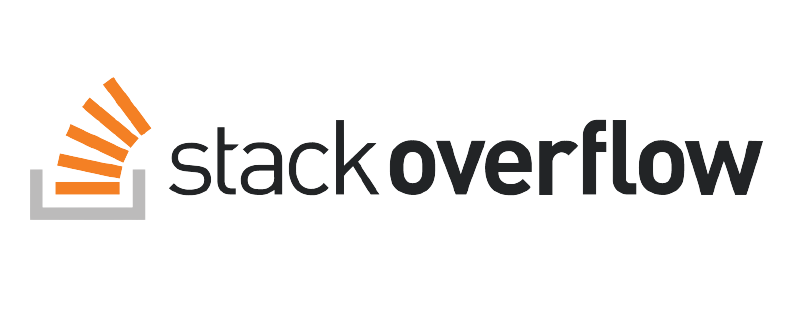

# Stack Overflow clone

## Description

This is a clone of part of [Stack overflow](https://stackoverflow.com) website using [Next.js](https://nextjs.org/) and [Express.js](https://expressjs.com/)

#### Features

- Admin Dashboard
  - You can manage companies, and jobs over the admin dashboard.
- You can [Add a company](https://learnwithalfred.github.io/admin)
  - A company has all the basic details an actual company can have.
  - [The companies page](https://learnwithalfred.github.io/companies) displays all the companies and a click will let you view the details about the company
- You can add a job and view details about a job just as you can do with an company
- View website live on https://learnwithalfred.github.io/stack_overflow_clone

##### There are many features we will be adding in the future. They can be found in the issues tab.

#### Installation

- Clone the repository into your local directory
- Remember the website is build using [Next.js](https://nextjs.org/) and [Express.js](https://expressjs.com/). So you need to set both up

##### Backend setup

- Change directory into the backend and install npm packages. You can do it with this command `cd backend && npm install `
- We are using mongo DB as database so you need to set it up
  - First create a mongo database locally or using atlas
  - Then in you root directory of your application create a .env file. You can do it with this`touch env` command
  - Set the DATABASE_URL for the mongoDB example `DATABASE_URL : YOUR_URL_GOES_HERE`
- You can now stat your application with this command `npm run start`

  - ( If you encounter any challenges, it might come from MongoDB. You can debug and fix it )

##### Frontend setup

Remember to keep the backend running whiles you run the frontend. You can open a different terminal for the frontend

- Change directory into the frond end folder and install the npm packages and run the app.
  - I am using npm instead of yarn so my command is `cd frontend && npm i && npm run start `
    - You can also run the code with yarn

> We are all set, everything is running. You need to add some data for testing

If you had any issues please debug.

[Api is live on heroku](https://sleepy-plains-97573.herokuapp.com/)

[Website is also live on github pages](https://learnwithalfred.github.io/)
